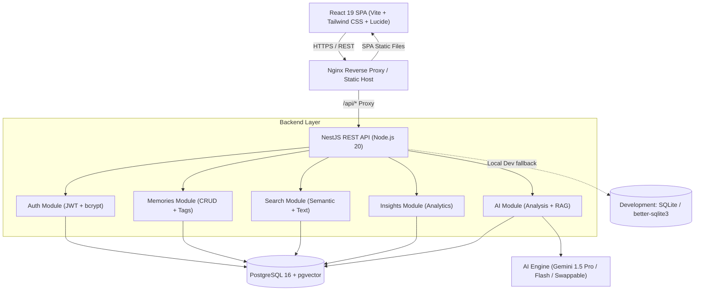
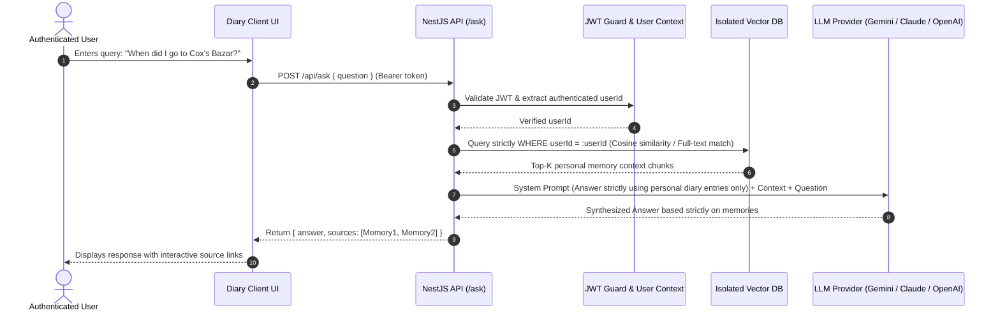

# MemoAI — System Architecture & Academic Design

## 1. High-Level System Architecture

MemoAI is designed following modern enterprise full-stack principles with modular layering, strict user privacy boundaries, and provider-agnostic AI capabilities.



---

## 2. Entity Relationship Diagram (ERD)

The database design is normalized to 3NF with dedicated join tables and vector embeddings for semantic search:

```mermaid
erDiagram
    USERS ||--o{ MEMORIES : owns
    CATEGORIES ||--o{ MEMORIES : categorizes
    MEMORIES ||--o{ MEMORY_IMAGES : contains
    MEMORIES ||--o{ MEMORY_TAGS : associates
    TAGS ||--o{ MEMORY_TAGS : associates
    MEMORIES ||--|| AI_ANALYSIS : analyzed_as
    MEMORIES ||--o{ MEMORY_EMBEDDINGS : embedded_in

    USERS {
        uuid id PK
        string name
        string email UK
        string passwordHash
        string profileImage
        datetime createdAt
        datetime updatedAt
    }

    CATEGORIES {
        string id PK
        string name UK
        string color
        string icon
    }

    TAGS {
        string id PK
        string name UK
    }

    MEMORIES {
        string id PK
        string userId FK
        string title
        text content
        date memoryDate
        string mood
        string categoryId FK
        string locationName
        float latitude
        float longitude
        datetime createdAt
        datetime updatedAt
    }

    MEMORY_IMAGES {
        string id PK
        string memoryId FK
        string imageUrl
        datetime createdAt
    }

    MEMORY_TAGS {
        string memoryId PK,FK
        string tagId PK,FK
    }

    AI_ANALYSIS {
        string id PK
        string memoryId FK,UK
        text summary
        string emotion
        json keywords
        json extractedEntities
        datetime createdAt
    }

    MEMORY_EMBEDDINGS {
        string id PK
        string memoryId FK
        string modelName
        json/vector embedding
        datetime createdAt
    }
```

---

## 3. Retrieval-Augmented Generation (RAG) Architecture ("Ask My Diary")

To prevent hallucinations and guarantee absolute privacy, the "Ask My Diary" engine follows an isolated RAG pipeline:



---

## 4. Security & Privacy Guarantees

1. **User Isolation Principle**:
   - Every read, update, delete, and AI query enforces `where: { id, userId }`.
   - Access attempts to other users' memories return HTTP `404 Not Found` rather than `403 Forbidden` to prevent resource enumeration attacks.
2. **Stateless JWT Authentication**:
   - Passwords salted and hashed with `bcryptjs` (salt rounds: 10).
   - JWT tokens verified via Passport JWT strategy on all private endpoints.
3. **Safe File Uploads**:
   - Multer middleware restricts uploads to images only (PNG, JPEG, WebP, GIF) with 5MB maximum file size limits.
